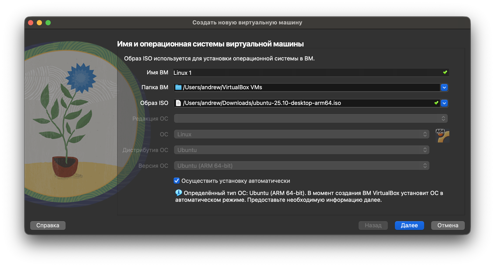
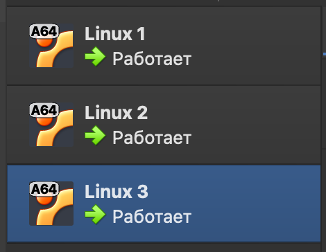
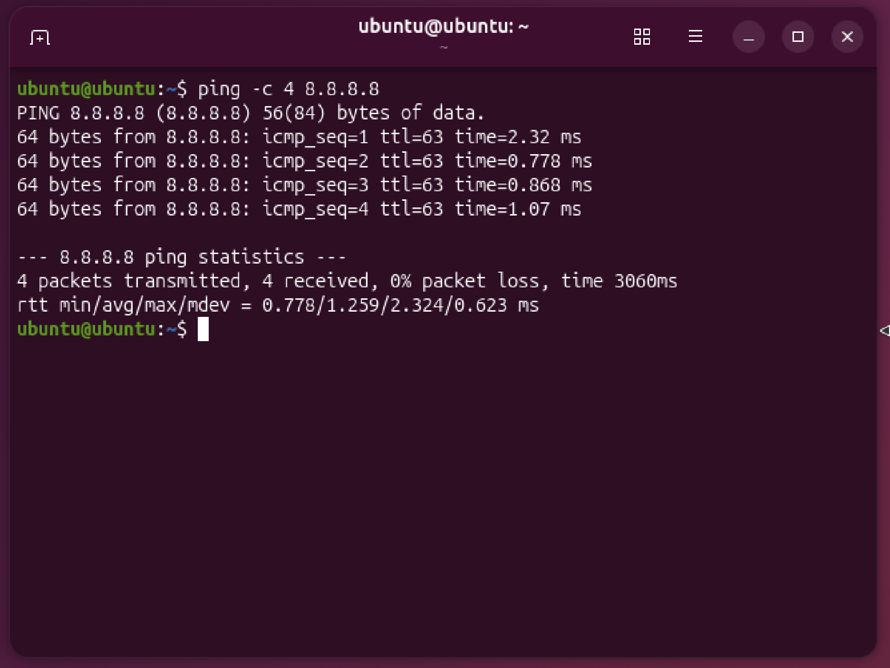
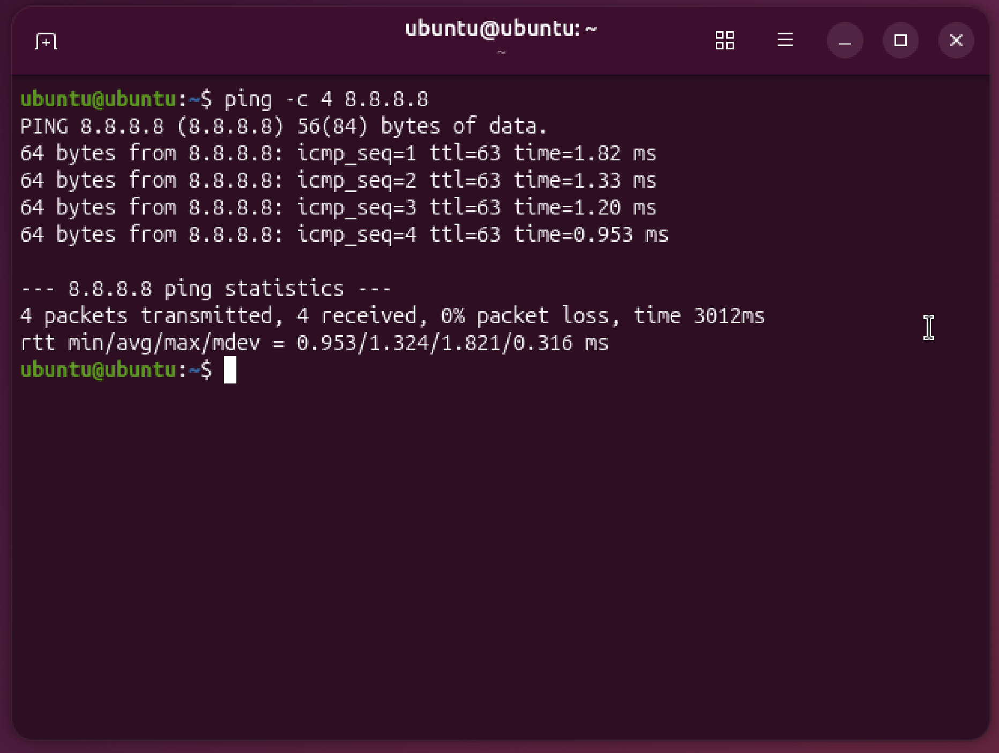
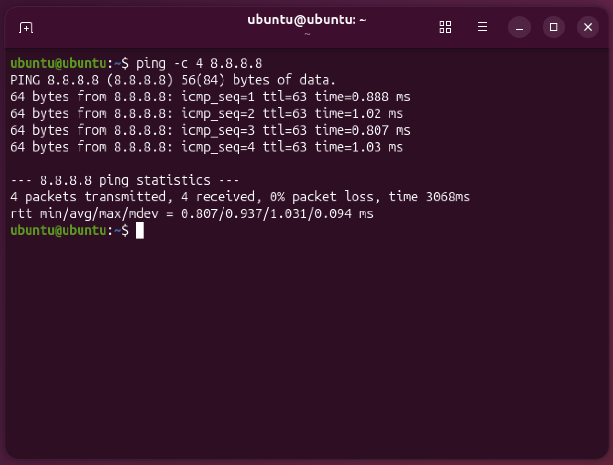
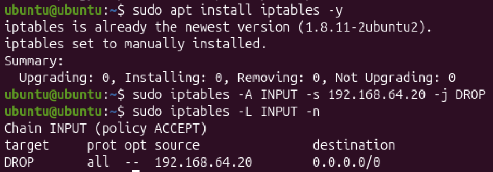
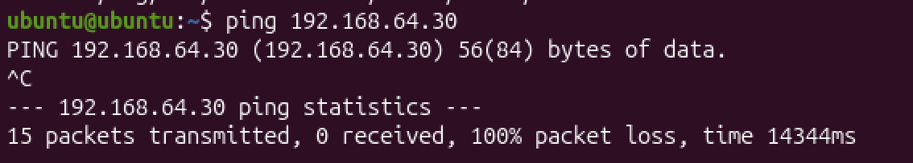
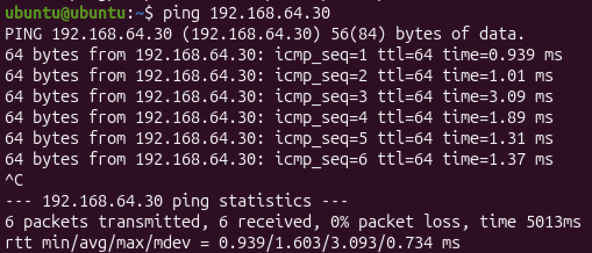
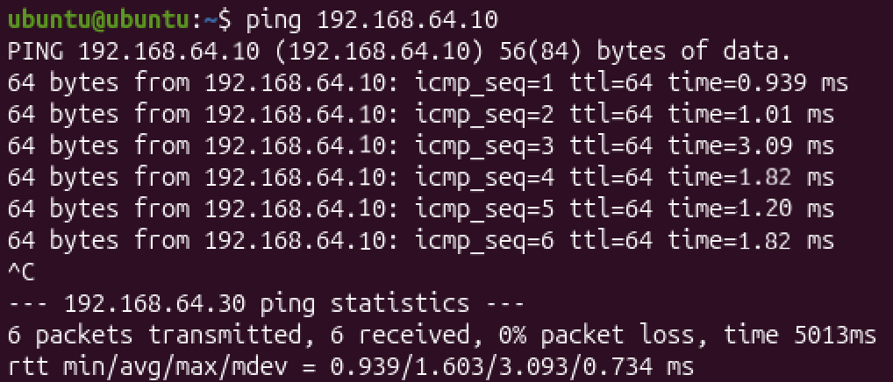

# Отчёт по лабораторной работе №3  
**Виртуализация и настройка сетевых подключений в VirtualBox**  

---

## Задание  
1. Установить VirtualBox и создать три виртуальные машины (А, Б, В) с Ubuntu.  
2. Настроить сетевые адаптеры для обеспечения доступа в Интернет.  
3. Обеспечить сетевое взаимодействие между виртуальными машинами.  
4. Запретить доступ из машины Б в машину В.  

---

## Ход работы  

### Установка VirtualBox и создание виртуальных машин  
- Установлен VirtualBox.  
- Создана виртуальная машина Ubuntu Desktop 25.10 LTS (Скриншот настройки ниже)


- Создано еще две аналогичные машины



### Проверка сетевого доступа
- 1 машина:


- 2 машина:


- 3 машина:



###  Настройка статических IP-адресов  
На каждой машине настроены статические IP-адреса через Netplan.  

**Конфигурация Netplan для машины А:**  
```yaml
network:
  version: 2
  ethernets:
    enp0s1:
      dhcp4: false
      addresses: [192.168.64.10/24]
      gateway4: 192.168.64.1
      nameservers:
        addresses: [8.8.8.8, 1.1.1.1]
```

**Конфигурация Netplan для машины B:** 
```yaml
network:
  version: 2
  ethernets:
    enp0s1:
      dhcp4: false
      addresses: [192.168.64.20/24]
      gateway4: 192.168.64.1
      nameservers:
        addresses: [8.8.8.8, 1.1.1.1]
```

**Конфигурация Netplan для машины C:** 
```yaml
network:
  version: 2
  ethernets:
    enp0s1:
      dhcp4: false
      addresses: [192.168.64.30/24]
      gateway4: 192.168.64.1
      nameservers:
        addresses: [8.8.8.8, 1.1.1.1]
```

### Изменение доступа машины В к машине Б

**Запретим доступ машине В к машине Б следующими командами:** 


### Проверка

**Проверим возможность подключения Б к В:**



0% пакетов возвращено, значит подключения не было

**Подключения A к В:**



**Подключения В к А:**



100% пакетов возвращено, подключение успешно

### Выводы:

- Настроена сетевая связность между машинами.
- Успешно заблокирован доступ из машины Б в машину В
- Получены практические навыки работы с виртуализацией.